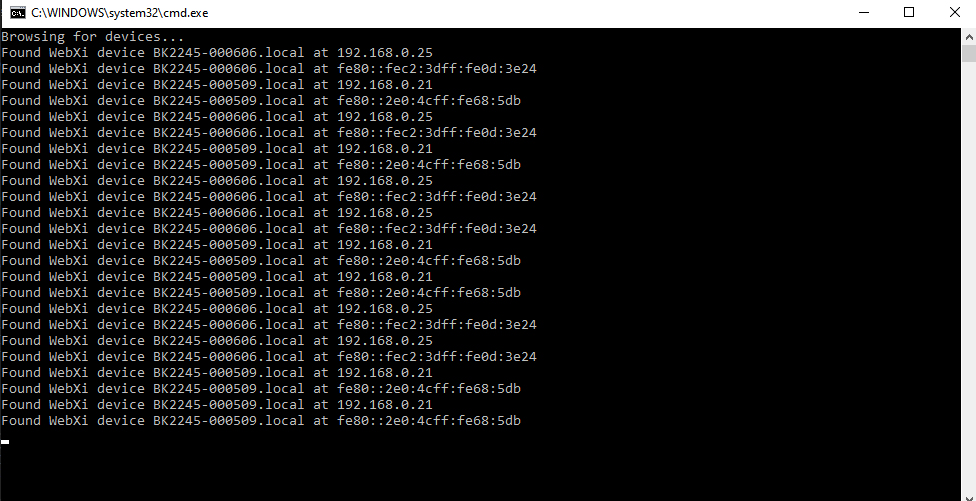

## SLM Device Discovery using mDNS

As mentioned in the documentation, the SLM implements network discovery based on Multicast DNS (mDNS); part of the zero-configuration networking technologies: https://en.wikipedia.org/wiki/Zero-configuration_networking

Each SLM presents itself as a “_web-xi.tcp" device

The “SLMDiscoveryExample.cs” file demonstrates how to browse for and discover SLMs on the network. Paste the code example into a Visual Studio .Net console application, and follow the instructions described in the top of the code file.

The output from running the code, should look like this:

*Discovering two SLMs on the network 'BK2245-000606' and 'BK245-000509'*

###### *Note: The C# sample code is using features from the Universal Windows Platform (UWP API) and will as such only run on Windows 10.*

Look for more information about UWP here: https://docs.microsoft.com/en-us/uwp/api

Look for more information about zero-configuration and Bonjour here: https://developer.apple.com/bonjour

See also the Bonjour library here: https://github.com/novotnyllc/Zeroconf

