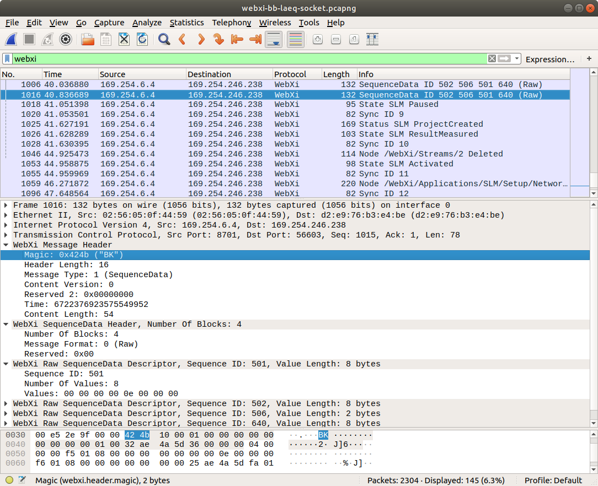

# Description

The **webxi.lua** file is a dissector for the WebXi streaming protocol supported by
the 2245 Sound Level Meter.

# Installation

Copy webxi.lua to the Wireshark plugins folder.

The location of the plugins folder might be:

* Windows: C:\Users\\(user)\AppData\Roaming\Wireshark\plugins

* Linux: /home/(user)/.local/lib/wireshark/plugins

Alternatively, open Wireshark and look up the folder that it uses:
Help - About Wireshark, Folders tab, Global/Personal Lua Plugins

# Development

The dissector is implemented in the Lua scripting language.

It is heuristic, which means it is not associated with any TCP or UDP port number.

Instead, Wireshark will call the dissector function for every packet, and the dissector
function will return a value that indicates whether the packet was recognized.

To modify or extend the dissector, make modifications directly to the .lua file and
then press Ctrl+Shift+L in Wireshark to reload.

For more information on dissector development, see

* Wireshark Lua API: <https://www.wireshark.org/docs/wsdg_html_chunked/wsluarm_modules.html>

* The fpm.lua sample that these dissectors were based on: <https://wiki.wireshark.org/Lua/Examples#A_dissector_tutorial_with_TCP-reassembly>

# Screenshots

